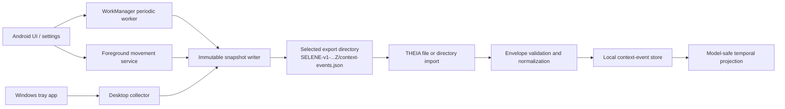
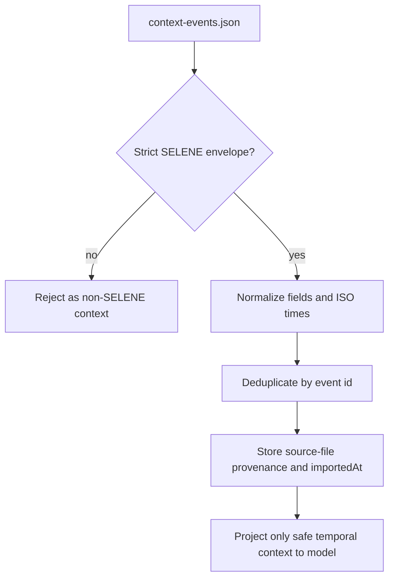

# SELENE Developer Guide

[English](DEVELOPER_GUIDE.md) | [简体中文](DEVELOPER_GUIDE.zh-CN.md)

This guide is for developers changing SELENE or its THEIA hand-off. It
describes the `0.3.0` codebase, not an aspirational design. Read it before
adding a signal, changing movement detection, altering the export schema, or
publishing a release.

## 1. What SELENE Is

SELENE is a local, standalone timeline collector with two independent clients:

- Android collects selected phone context and optional continuous movement.
- Windows collects coarse desktop activity, idle, power, and network state.

It is deliberately **not** a THEIA plugin, a cloud service, or a database
manager. Each client writes new immutable files below a user-selected export
directory. THEIA is a separate consumer that imports the files later.

The following invariants are more important than any individual collector:

1. A collector writes a new snapshot; it never reads, merges, overwrites, or
   deletes an earlier SELENE snapshot.
2. The selected export directory is the only cross-application data boundary.
   SELENE does not scan THEIA files or private data belonging to another app.
3. Event time is the time the signal happened. Import time belongs to THEIA.
4. Exact coordinates require explicit capture consent and are never projected
   to THEIA's model input.
5. A schema change must remain readable by the deployed THEIA importer, or it
   must use a new schema version.

## 2. Read This First

Read the documents in this order when joining the project:

1. This guide for ownership boundaries and change procedure.
2. [EXPORT_LAYOUT.md](EXPORT_LAYOUT.md) for the on-disk contract.
3. [ANDROID_MOVEMENT.md](ANDROID_MOVEMENT.md) or
   [WINDOWS_DESKTOP.md](WINDOWS_DESKTOP.md) for a platform-specific change.
4. [THEIA SELENE event contract](https://github.com/bakahuiii/THEIA/blob/main/docs/SELENE_EVENTS.md)
   before modifying events that THEIA imports.
5. [RELEASE_PROCESS.md](RELEASE_PROCESS.md) before publishing binaries.

## 3. Repository Map

| Area | Main files | Responsibility |
| --- | --- | --- |
| Android configuration | `app/src/main/.../MainActivity.kt`, `AutoCollectionSettings.kt` | Settings screen, Android permission sequence, collection gates, WorkManager schedule. |
| Android periodic collectors | `AutoContextWorker.kt`, `PlaceTagger.kt`, `OnlinePlaceEnricher.kt` | Hourly-ish non-continuous signals and a fresh-location fallback. |
| Android movement | `MovementTrackingService.kt` | Foreground location service, filtering, movement state machine, batches, summary event. |
| Android output | `ContextOutput.kt` | Android Storage Access Framework (SAF) writes and local-offset timestamps. |
| Windows UI | `desktop/SELENE.Windows/MainWindow.xaml.cs` | Tray-window lifecycle, timers, settings binding, capture feedback. |
| Windows capture | `Core/DesktopCollector.cs`, `ForegroundSessionTracker.cs`, `SystemSnapshotCollector.cs` | Signal collection, foreground session accounting, power/network/idle values. |
| Windows output | `Core/SeleneProtocol.cs` | Event records, compact JSON, unique immutable snapshot allocation. |
| Windows local state | `Core/SettingsStore.cs`, `AppLogger.cs`, `WindowsStartup.cs` | Settings, diagnostic log, optional current-user startup entry. |
| Windows regression test | `desktop/SELENE.Windows.ContractTests/Program.cs` | Immutable-directory and byte-preservation contract check. |
| Release tooling | `tools/prepare-release.ps1` | Rebuild, test, package, validate, and checksum release artifacts. |
| THEIA consumer | `THEIA/src/lib/contextEvents.ts`, `THEIA/src/lib/importer.ts` | Envelope validation, event normalization, deduplication, and model-safe projection. |

## 4. End-to-End Data Flow



The arrows intentionally do not point back from THEIA to SELENE. Import is
one-way. A duplicate file import is harmless only when event IDs are stable.

## 5. Shared Export Contract

### Snapshot envelope

Every successful write creates a new directory named using a UTC timestamp:

```text
<export root>/SELENE-v1-20260807T032000123Z/context-events.json
```

The directory timestamp is UTC so lexicographic ordering remains stable across
timezone changes. JSON timestamps use the operating system timezone and ISO
8601 offset, for example `2026-08-07T11:20:00.123+08:00` on this machine.

```json
{
  "schema": "selene-context-events/v1",
  "device": { "platform": "android" },
  "generatedAt": "2026-08-07T11:20:00.123+08:00",
  "producer": {
    "name": "SELENE",
    "version": "0.3.0",
    "layout": "immutable-snapshot-v1"
  },
  "events": []
}
```

THEIA rejects the document unless its schema, `producer.name`, producer layout,
and event array match this contract. Do not use a generic JSON file as an
import shortcut.

### Event fields

| Field | Rule |
| --- | --- |
| `id` | Stable across a retry of the same observation. It is the deduplication key. Do not use a random UUID for ordinary periodic events. |
| `version` | Event-shape version. Current value is `1`. |
| `kind` | One of `calendar`, `location`, `movement`, `screen-time`, `activity`, `health`, `payment`, `device`, or `custom`. New kinds require a THEIA change. |
| `source` | Current SELENE producers use `selene`. |
| `startAt`, `endAt` | ISO 8601. `endAt`, if present, must not be before `startAt`. |
| `title`, `summary` | Short human-readable text. Do not put raw private content here. |
| `values` | Scalar string, number, or boolean metadata. Preserve documented key names and keep it free of raw text, coordinates, addresses, window titles, and URLs. |
| `capturedAt` | When SELENE emitted the event. It can differ from `startAt`. |
| `importedAt` | Normally omitted by SELENE. THEIA supplies actual import time; producers must not claim an import they did not perform. |
| `privacy` | `coarse` for normal context. Only precise `location` events with explicit consent may carry coordinates. |

### Identity and retry behavior

An immutable snapshot does not mean exactly-once delivery. A collector can be
retried, a batch can be flushed twice, and a user can import the same directory
more than once. Stable IDs make those cases idempotent in THEIA.

- Android movement points use the confirmed `trackId` and sequence number.
- Android movement summaries use the same `trackId`.
- Windows periodic events include the observed time window and, for activity,
  a stable hash of the executable name.

If an event's identity inputs change, it is a new event. Do not "fix" old
snapshots; write a new snapshot and let THEIA retain provenance.

### Storage-size policy

SELENE controls size without lossy downsampling of exported information:

- JSON is compact UTF-8, not pretty printed.
- Android writes movement batches at 24 events or roughly 120 seconds instead
  of placing the same envelope around every point.
- Both platforms omit producer-side `importedAt`, which would otherwise repeat
  information THEIA derives at import.
- Windows serializes one compact envelope per capture and reports its byte
  count to the UI and diagnostic log.

Do not remove fields, round a measurement more aggressively, or merge old
snapshots merely to make files smaller. Those are information-loss changes.

## 6. Android Architecture

### 6.1 Configuration and lifecycle

`MainActivity` owns user-facing setup. `syncMovementTracking()` starts the
movement service only when all of these are true:

1. Automatic collection is enabled.
2. The background-movement setting is enabled.
3. A SAF export tree URI is present.
4. Fine location is granted.
5. On Android 10+, background location is granted.

It also asks for Android 13+ notification permission so the foreground-service
state is visible. Notification permission is not location permission; the
service still needs the location grants above.

`AutoCollectionScheduler` owns WorkManager. It is for calendar, screen/app,
device, network, and fallback context, not for continuous travel. Stopping the
scheduler also stops the movement service.

`ContextOutput.writeEvents()` is synchronized because a periodic worker and
the service can write concurrently. It creates a new SAF directory and a new
`context-events.json` file for every call.

### 6.2 Periodic worker versus live movement

`AutoContextWorker` deliberately treats the last known location as a fallback:

- it accepts a location only when it is at most 30 minutes old;
- it emits `sampleMode: "last-known-fallback"` and
  `movementTracking: "foreground-service"`;
- it never starts or reconstructs a route.

This separation fixes the original failure mode: an hourly passive lookup can
miss an entire walk that begins and ends before the next worker execution.

### 6.3 Movement service state machine

`MovementTrackingService` requests GPS and network updates every 15 seconds
with an 8-metre provider distance hint. Those are request hints, not a promise:
Android and OEM power policy can delay, batch, or stop updates.

```mermaid
stateDiagram-v2
  [*] --> IDLE
  IDLE --> CANDIDATE: accepted point has start evidence
  CANDIDATE --> MOVING: two evidence samples within 90 seconds
  CANDIDATE --> IDLE: timeout or evidence expires
  MOVING --> MOVING: record accepted point
  MOVING --> IDLE: 90s stationary or 150s without movement evidence
  MOVING --> IDLE: service stops; summary and pending batch are flushed
```



The candidate buffer holds at most four accepted points. It is written only
after confirmation. This retains the beginning of a real walk but prevents a
few steps at home from becoming a standalone trip.

### 6.4 Acceptance and movement thresholds

An input point is rejected before it touches state when it is stale, too far in
the future, has no usable accuracy, has accuracy above 80 m, is out of time
order, or implies an implausible jump above 45 m/s after accuracy allowance.

Speed is derived from distance and elapsed time when necessary. When Android
also reports speed, SELENE averages reported and derived speed only when they
are within 8 m/s; otherwise it uses the derived value. A reported speed counts
as independent speed evidence only with location accuracy at most 35 m and,
when supplied, speed accuracy at most 2.5 m/s.

| Purpose | Threshold |
| --- | --- |
| Start evidence | Speed >= 0.8 m/s, or distance >= `max(15 m, 0.75 * combined accuracy)` |
| Ongoing evidence | Speed >= 0.65 m/s, or distance >= `max(10 m, 0.5 * combined accuracy)` |
| Stationary evidence | Speed <= 0.4 m/s and distance <= `max(8 m, 0.3 * combined accuracy)` |
| Confirmation | 2 start-evidence samples within 90 seconds |
| Candidate capacity | 4 points |
| Normal end | 90 seconds of stationary evidence |
| Unknown-data end | 150 seconds without movement evidence, checked every 30 seconds |
| Flush | 24 events or 120 seconds, plus start/end and destruction |

The two different start and ongoing thresholds are intentional hysteresis.
Never tune one in isolation: a lower start threshold may create indoor false
tracks, while a higher ongoing threshold may split slow walking into fragments.

### 6.5 Event production and failure behavior

While moving, each accepted point becomes a precise `location` event with:

- `trackId`, `sequence`, `moving: true`;
- speed in m/s and km/h;
- distance from the preceding accepted point;
- accuracy, provider, and `sampleMode: "foreground-service"`;
- coordinates and an explicit `locationConsent` object with
  `captureMode: "foreground"`.

When the state ends, SELENE emits one coarse `movement` summary with duration,
distance, average and maximum speed, sample count, and the same `trackId`.

Writes are queued on one I/O executor. A transient SAF write error places the
batch back in memory for a later flush. This is not durable queueing: a process
kill before a successful write can lose the in-memory batch. Do not invent
points or extrapolate a route across that gap. On service destruction, SELENE
finishes any confirmed track, requests a force flush, and waits up to three
seconds for its executor.

### 6.6 Safe Android changes

For a new Android signal:

1. Decide whether it is periodic context or needs a live foreground service.
2. Check the Android permission, disclosure, and foreground-service policy.
3. Keep collection locally authorized and avoid raw content by design.
4. Build a stable event ID and use the v1 envelope fields.
5. Add the THEIA parser/type/test change before emitting a new `kind`.
6. Verify on a physical device; emulator location and WorkManager timing are
   insufficient for movement behavior.

For a movement-threshold change, test at least: indoor steps, a 10-20 minute
walk, a short stop during a walk, stale location delivery, low-accuracy network
fixes, permission revocation while running, and disabling the feature during a
confirmed track.

## 7. Windows Architecture

### 7.1 Application lifecycle

The WPF process is a visible tray application, not a Windows service. Closing
the main window hides it; the tray Exit command performs a real shutdown.
Collection exists only while this process is alive. Optional startup writes a
current-user Run entry only for a published executable, never for a debug run.

`MainWindow` runs two independent timers:

- every 10 seconds, `ForegroundSessionTracker.Observe()` samples the current
  foreground executable name;
- at 5, 15, 30, or 60 minute intervals, `DesktopCollector.CaptureAsync()`
  creates a snapshot when automatic collection and a valid output folder are
  enabled.

Automatic collection also performs one immediate capture when the application
initializes with a valid folder.

### 7.2 Collection and consistency

`DesktopCollector` serializes captures with `SemaphoreSlim`. It cuts completed
foreground sessions, builds screen-time/activity/device/network events, and
writes them through `ImmutableSnapshotWriter`.

The ordering matters:

1. `ForegroundSessionTracker.CutAndDrain()` closes the active session at the
   capture boundary and returns completed segments.
2. The writer creates a new directory, opens JSON with `FileMode.CreateNew`,
   writes compact JSON, and flushes it to disk.
3. Only after success does `DesktopCollector` advance `previousCaptureAt`.
4. If writing fails, `Restore()` requeues the drained sessions in time order;
   the next capture can include them again.

This prevents a failed write from silently losing foreground-session history.
Sessions shorter than five seconds are omitted as individual `activity` events
but remain represented in the aggregate `screen-time` event.

### 7.3 Windows event set

| Event | Values | Notes |
| --- | --- | --- |
| `screen-time` | `foregroundSeconds`, `activeAppCount`, `windowSeconds` | One aggregate for the capture window. |
| `activity` | executable `application`, `durationSeconds`, `detail` | Foreground executable only; no title, URL, arguments, or document name. |
| `device` | idle, power, battery values | Current state, not an activity history. |
| `device` | network availability and coarse transport | A separate network snapshot, also `kind: "device"`. |

`ImmutableSnapshotWriter` probes millisecond suffixes if a directory already
exists, up to 1,000 attempts. This protects immutable output when two writes
use the same clock time. JSON is compact and uses the system's local offset;
directory names remain UTC.

Settings use `%LOCALAPPDATA%\SELENE\desktop-settings.json` and are written via
a temporary file followed by replace. Diagnostics are in
`%LOCALAPPDATA%\SELENE\logs\selene-YYYYMMDD.log`. Neither is an exported
timeline or a THEIA input.

### 7.4 Safe Windows changes

When adding a Windows signal, avoid scraping text from another process. Favor
coarse scalar state. Update `DesktopCollector`, keep capture serialization, add
a stable ID, then extend `desktop/SELENE.Windows.ContractTests` if immutable
output behavior or serialization changes. Do not make the collector a service
without revisiting privacy disclosure, session isolation, and installer design.

## 8. THEIA Import and Privacy Boundary

THEIA owns validation and import semantics. SELENE must not assume a file is
accepted merely because it is valid JSON.



`THEIA/src/lib/contextEvents.ts` applies the following rules:

- unknown `kind` values become `custom`; unknown sources are rejected;
- invalid ISO dates, invalid end ordering, and malformed envelope metadata are
  rejected or normalized away;
- only scalar `values` entries with valid keys are retained;
- exact coordinate data is retained locally only for `kind: "location"`,
  `privacy: "precise"`, and valid explicit consent;
- model projection removes coordinates, address-like value keys, and consent
  information. For location it exposes only a coarse location title and an
  optional `placeTag`.

The `movement` summary is intentionally a separate kind. It reaches THEIA as
`movement`, rather than being silently downgraded to `custom`. Any new SELENE
kind must be added to THEIA's `ContextEventKind`, accepted-kind set, docs, and
tests before release.

## 9. Build, Test, and Manual Verification

Run commands from the SELENE repository root.

### Android

```powershell
$env:JAVA_HOME = '<JDK_17_HOME>'
$env:ANDROID_HOME = '<ANDROID_SDK_HOME>'
gradle --no-daemon :app:lintDebug :app:assembleDebug
```

The APK is `app\build\outputs\apk\debug\app-debug.apk`. Address new lint
errors; existing Android framework deprecation warnings must not be hidden by
blanket suppression.

### Windows

```powershell
dotnet build desktop\SELENE.Windows\SELENE.Windows.csproj -c Release
dotnet run --project desktop\SELENE.Windows.ContractTests\SELENE.Windows.ContractTests.csproj -c Release
```

The contract test writes two snapshots at the same supplied timestamp, verifies
different directory names, and checks that the first JSON remains unchanged.

### THEIA compatibility

Run this in the THEIA repository after changing the common contract:

```powershell
npm run test:context-events
```

Also import a real exported parent directory in THEIA. Confirm the movement
summary remains `movement`, duplicate import does not increase event count, and
coordinates are absent from the model-facing context.

### Physical-device checklist

1. Use a new export directory and grant only the intended permissions.
2. Confirm the foreground notification appears only after all movement gates
   are met.
3. Walk long enough to create two accurate movement-evidence samples.
4. Inspect JSON: local-offset timestamps, UTC directory name, shared `trackId`,
   point sequence, and one final summary.
5. Walk a few indoor steps and confirm no standalone movement track appears.
6. Disable background location or automatic collection during a track and
   confirm the confirmed portion is finalized without rewriting old files.

## 10. Change and Release Checklist

Before merging a behavioral change, answer all of these:

1. Which platform owns the signal, and why is that platform authorized to read
   it?
2. Is it periodic state, a foreground session, or continuous movement?
3. What makes its ID stable over retries?
4. Which fields are source time, capture time, and import time?
5. Could any text, coordinate, address, title, URL, or credential cross the
   export or model boundary?
6. Does THEIA already understand the kind and all required metadata?
7. What happens on permission revocation, process death, a full disk, or a
   failed SAF write?
8. Which automated and physical-device tests prove the expected behavior?

For a binary release, use:

```powershell
$env:JAVA_HOME = 'C:\Program Files\Eclipse Adoptium\jdk-17.0.19.10-hotspot'
.\tools\prepare-release.ps1 -Version <version>
```

The script refuses to overwrite an existing `releases\v<version>` staging
directory. It runs Android lint/build, Windows build and contract test,
self-contained Windows publish, APK manifest/alignment/signature verification,
ZIP inventory checking, and SHA-256 generation. Follow
[RELEASE_PROCESS.md](RELEASE_PROCESS.md) for the tag, GitHub attachment, and
downloaded-asset checksum steps. The Android artifact is intentionally named
`android-debug.apk` until a separately managed release-signing key exists.

## 11. Reference Links

- [Android movement details](ANDROID_MOVEMENT.md)
- [Windows collector details](WINDOWS_DESKTOP.md)
- [Export layout](EXPORT_LAYOUT.md)
- [Release process](RELEASE_PROCESS.md)
- [THEIA event contract](https://github.com/bakahuiii/THEIA/blob/main/docs/SELENE_EVENTS.md)
- [THEIA importer source](https://github.com/bakahuiii/THEIA/blob/main/src/lib/contextEvents.ts)
