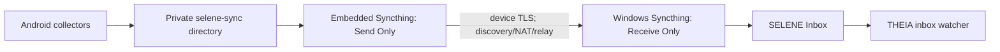

# SELENE One-Time Android / Windows Pairing

[English](P2P_SYNC.md) | [简体中文](P2P_SYNC.zh-CN.md)

SELENE 0.5.2 runs a Syncthing native core inside the Android application. A
user generates one short-lived QR code in SELENE Windows and scans it once on
the phone. Immutable snapshots then synchronize automatically whenever a
network is available. Enrollment requires one shared trusted LAN; later sync
does not require the same Wi-Fi or a self-hosted server.

## User Flow

### Windows

1. Open SELENE Windows and find **Android one-time pairing**.
2. Confirm the inbox. SELENE defaults to the current user's app-data directory
   and reuses the existing path if Syncthing already has `selene-inbox-v1`.
3. Enable start-at-login so SELENE can restore the Windows sync process after
   every sign-in.
4. Select **Generate one-time pairing QR**. If Syncthing is absent, the explicit
   action installs the official `Syncthing.Syncthing` winget package.
5. If Windows Firewall asks, allow SELENE on private networks only. The
   enrollment listener exists for five minutes.

### Android

1. Install SELENE 0.5.2 and grant only the collection permissions you intend
   to use.
2. Temporarily connect the phone and Windows computer to the same trusted LAN.
3. Select **Scan Windows pairing QR**. Without a camera, select **Enter Windows
   pairing code** and paste the code copied by Windows.
4. Wait for both applications to report success. Pairing enables periodic
   collection and removes the need for an SAF export folder. Continuous
   movement still requires fine/background location and its setting.
5. Restart THEIA once so it inherits the Windows user variable
   `THEIA_SELENE_INBOX`. No later scan is required.

## Data Flow

Android always writes locally first. If either peer is offline, completed
snapshots remain in private app storage and Syncthing catches up later. The
phone folder is Send Only and Windows is Receive Only, preventing a Windows
file from overwriting collector output.

## Enrollment Protocol

A regular Syncthing device-ID QR is insufficient: it makes Android trust
Windows but still leaves Windows waiting for manual phone approval. SELENE
adds a `selene-pair/v1` enrollment handshake:

1. Windows creates a 256-bit token, a ten-minute self-signed certificate, and
   a five-minute offer expiry.
2. The QR contains the Windows device ID, folder ID, LAN HTTPS endpoints,
   one-use token, expiry, and certificate SHA-256. It never contains the
   Syncthing GUI API key.
3. Android validates the schema, IDs, expiry, private IPv4 endpoints, and
   pinned certificate before starting its embedded core.
4. Android adds Windows and its Send Only folder locally, then returns its own
   device ID over the pinned TLS connection.
5. Windows compares the token in constant time, adds the phone through the
   local Syncthing CLI, shares the Receive Only folder, and closes the listener.

The listener rejects public/non-HTTPS endpoints, requests above 32 KiB, wrong
tokens or folder IDs, and malformed device IDs. Treat the unexpired QR as a
temporary credential and enroll only on a trusted LAN.

## Persistence and Recovery

- Android identity/config lives in `noBackupFilesDir`, outside auto backup.
- Snapshots live under private `filesDir/selene-sync`. Android deletes app data
  on uninstall, so confirm Windows is complete before uninstalling.
- Boot and package-replaced broadcasts restore paired sync, WorkManager, and
  the movement service when its permission gates are satisfied.
- On startup, SELENE Windows finds Syncthing through winget, PATH, or
  `SELENE_SYNCTHING_PATH`, starts it hidden, validates `selene-inbox-v1`, and
  sets the current-user `THEIA_SELENE_INBOX` variable.
- Android disconnect removes the Windows remote config and stops sync while
  preserving snapshots and the phone identity. Remove an obsolete phone entry
  from the Windows Syncthing GUI when necessary.

Android 8+ legally requires a visible notification for this persistent
foreground service. SELENE uses a silent low-importance channel, but it cannot
hide the system-mandated notification. OEM battery controls may still kill the
process; allow unrestricted battery and background data for reliable sync.

## Status and Troubleshooting

Android reports Windows connectivity, folder state, and remote completion.
Windows reports waiting, expiry, or successful enrollment.

Android `0.5.2` persists the core startup phase, consecutive failure count,
exit code, and a short sanitized log tail in private preferences. Initial
device identity generation may run for up to 120 seconds. Missing core files,
unsupported ABIs, and missing execute permission now fail immediately with a
specific message instead of the generic startup timeout.

| Symptom | Resolution |
| --- | --- |
| "Native core file is missing" with an ABI list | The APK supports `arm64-v8a` and `armeabi-v7a`; install the complete APK and confirm that the listed device ABI is supported. |
| "Native core file is not executable" | Install the complete Android 0.5.2 APK without a third-party repacker that recompresses or splits native libraries. |
| "Core process exited" with a code | Preserve the full displayed error. It includes a sanitized recent core-output tail for diagnosing arguments, OS restrictions, or damaged config. |
| "Core is running, but its local API is not ready" followed by an Apache XML feature URI | Android 0.5.2 replaces the incompatible DOM feature with Android's pull parser; update the app and retry. |
| "Windows pairing request did not arrive" | Verify one LAN, a Private Windows network profile, and firewall permission; generate a new code. |
| Expired QR | Generate another offer. An old token cannot be resumed. |
| Syncthing missing on Windows | Generate a code to invoke winget, or set `SELENE_SYNCTHING_PATH` to the runtime binary. |
| Conflicting folder mode | Change `selene-inbox-v1` to Receive Only in local Syncthing; SELENE will not silently overwrite it. |
| THEIA does not import | Restart THEIA, check `THEIA_SELENE_INBOX`, then query `/api/selene-sync/status`. |
| Remote networks stay offline | Leave global discovery, NAT traversal, and relay fallback enabled; check Android background-data/battery policy. |
| Android reinstalled | Pair again because a new app install has a new device identity. |

## Size and ABI Policy

The APK packages only physical-phone `arm64-v8a` and `armeabi-v7a` cores, not
x86 emulator binaries. Snapshots remain compact UTF-8 JSON with 24-event/about
120-second movement batches. Sync does not remove fields or reduce precision;
Syncthing transfers content-addressed blocks for new files.

Exact source revisions, release checksum, and licenses are recorded in
[THIRD_PARTY_NOTICES.md](../THIRD_PARTY_NOTICES.md).

## Development Verification

1. Confirm the APK has both ARM native cores and no x86 core.
2. Generate a Windows offer and verify it contains no GUI API key or source-tree
   absolute path.
3. Scan on a physical phone and verify both peers and `selene-inbox-v1` appear
   without manual Syncthing approval.
4. Create a snapshot while one peer is offline and verify eventual complete
   JSON after reconnecting across a different network.
5. Reboot both peers and verify no second scan is required.
6. Verify duplicate, expired, and wrong tokens add no device, and disconnect
   deletes no existing snapshot.
