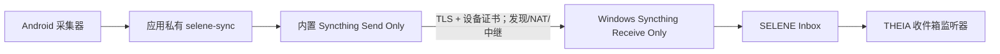

# SELENE Android / Windows 一次配对同步

[English](P2P_SYNC.md) | [简体中文](P2P_SYNC.zh-CN.md)

SELENE 0.5.2 在 Android 应用内部运行 Syncthing 原生核心。用户只需在 Windows
SELENE 生成一次性二维码，然后用手机扫描一次；之后手机会在有网络时自动把不可变
快照同步到 Windows。首次 enrollment 需要两台设备在同一局域网，后续同步不要求
同一 Wi-Fi，也不需要自建服务器。

## 用户操作

### Windows

1. 打开 SELENE Windows，进入“Android 一次配对同步”。
2. 确认“收件箱”目录。SELENE 默认使用当前用户的应用数据目录；如果 Syncthing
   已有 `selene-inbox-v1`，SELENE 会复用它的现有路径。
3. 建议开启“登录 Windows 后启动 SELENE”，这样每次登录后同步端都会自动恢复。
4. 点击“生成一次性配对二维码”。如果没有 Syncthing，SELENE 会通过 winget 安装
   官方 `Syncthing.Syncthing` 包。
5. Windows 防火墙首次询问时，只允许“专用网络”。配对监听器只运行 5 分钟。

### Android

1. 安装 SELENE 0.5.2，在系统权限流程中授予你要启用的采集权限。
2. 让手机和 Windows 暂时连接同一个家庭/可信局域网。
3. 在“远程同步”中点击“扫描 Windows 配对二维码”；没有相机时可点击“输入
   Windows 配对码”并粘贴 Windows 复制出的代码。
4. 等待两端显示“配对成功”。SELENE 会自动开启周期采集，不再要求选择 SAF 导出
   文件夹。持续移动仍需要精确位置、后台位置和相应开关。
5. 第一次配对后重启 THEIA，使它继承 Windows 用户环境变量
   `THEIA_SELENE_INBOX`。以后不需要再扫码。

## 数据流

Android 仍然先本地落盘。网络中断、Windows 关机或手机离线时，已经生成的快照保留
在手机应用私有目录；连接恢复后 Syncthing 会补传。Windows 端目录固定为 Receive
Only，手机端固定为 Send Only，防止 Windows 文件反向覆盖采集端。

## 一次性配对协议

二维码不是普通 Syncthing 设备 ID。普通设备 ID 只能让手机信任 Windows，Windows
仍会等待人工批准手机，因此无法“一次扫描完成”。SELENE 使用
`selene-pair/v1` enrollment：

1. Windows 创建 256 位随机令牌、10 分钟自签名证书和 5 分钟过期时间。
2. 二维码包含 Windows 设备 ID、文件夹 ID、局域网 HTTPS 地址、一次性令牌、过期
   时间和证书 SHA-256 指纹。它不包含 Syncthing GUI API key。
3. Android 严格验证 schema、设备 ID、文件夹 ID、有效期、私有 IPv4 地址和证书
   指纹，然后启动内置核心。
4. Android 在自己的配置中加入 Windows 和 Send Only 文件夹，并通过证书固定的
   HTTPS 连接回传手机设备 ID。
5. Windows 使用恒定时间令牌比较，通过本机 Syncthing CLI 加入手机并共享 Receive
   Only 文件夹，然后立即停止监听器。一个配对码只能成功一次。

配对端拒绝公网地址、非 HTTPS 地址、超过 32 KiB 的请求、错误令牌、错误文件夹和
非法设备 ID。首次配对应只在可信局域网进行；二维码在过期前也应视为临时凭据。

## 持久化与自动恢复

- Android Syncthing 身份和配置在 `noBackupFilesDir`，不会进入 Android 自动备份。
- Android 快照在应用私有 `filesDir/selene-sync`；卸载 SELENE 会由 Android 删除
  应用数据，因此卸载前应确认 Windows 已完成同步。
- Android `BOOT_COMPLETED` 和应用升级完成后会恢复已配对的 Syncthing、
  WorkManager 和满足权限条件的运动服务。
- Windows SELENE 启动时会寻找 winget/PATH/`SELENE_SYNCTHING_PATH` 中的
  Syncthing，启动隐藏进程，校验 `selene-inbox-v1` 并设置当前用户的
  `THEIA_SELENE_INBOX`。
- Android 端“解除配对”会移除 Windows 远端配置、停止同步并保留本地快照和手机
  Syncthing 身份。Windows 端旧设备条目可在 Syncthing GUI 中手动删除。

Android 8+ 对长期后台任务要求可见的前台服务通知。SELENE 把同步通知设为低重要性、
无声音，但不能合法隐藏系统要求的通知。部分厂商还会在省电模式中终止后台进程；应
把 SELENE 设为不受限制，并允许后台网络。

## 状态与排错

Android 设置页显示 Windows 是否连接、Syncthing 文件夹状态和远端完成百分比。
Windows 显示 enrollment 是否等待、过期或成功。

Android `0.5.2` 会把核心启动阶段、连续失败次数、退出码及最近一小段脱敏日志保存在
应用私有偏好中。首次生成设备身份最长等待 120 秒；如果核心文件缺失、ABI 不支持或
没有执行权限，会立即报告具体原因，不再统一显示“同步核心启动超时”。

| 现象 | 处理 |
| --- | --- |
| “原生核心文件缺失”并列出设备 ABI | 当前 APK 只支持 `arm64-v8a` 和 `armeabi-v7a`；确认安装的是完整 APK，且手机 ABI 在列表内。 |
| “原生核心文件没有执行权限” | 安装 Android 0.5.2 完整 APK；不要用会重新压缩或拆分本地库的第三方打包工具。 |
| “核心进程退出，代码 …” | 保留界面显示的完整错误；它已包含脱敏后的最近核心输出，可直接用于定位参数、系统限制或配置损坏。 |
| “核心已运行，但本地接口未就绪”，后跟 Apache XML feature 链接 | Android 0.5.2 已将不兼容的 DOM feature 替换为 Android pull parser；覆盖安装后重试。 |
| 扫码后“Windows 配对请求未送达” | 确认同一局域网、Windows 网络类型为“专用”、防火墙允许 SELENE，然后生成新码。 |
| 二维码已过期 | Windows 重新生成；旧令牌不会恢复。 |
| Windows 找不到 Syncthing | 点击生成配对码触发 winget 安装，或设置 `SELENE_SYNCTHING_PATH` 为运行时路径。 |
| Windows 文件夹模式错误 | 在本机 Syncthing 将 `selene-inbox-v1` 改为 Receive Only；SELENE 不会静默改写冲突配置。 |
| 配对成功但 THEIA 没导入 | 重启 THEIA，检查 `THEIA_SELENE_INBOX`，再查看 `/api/selene-sync/status`。 |
| 跨网络长期离线 | 保持全局发现、NAT 和中继启用；检查手机后台流量和省电限制。 |
| Android 卸载后重新安装 | 应重新配对；新安装会生成新的设备身份。 |

## 文件大小与支持范围

Android APK 只打包 `arm64-v8a` 和 `armeabi-v7a` 两个真实手机 ABI，不携带 x86
模拟器核心。快照仍使用紧凑 UTF-8 JSON、24 事件/约 120 秒运动批次和不可变目录；
同步不会改变事件字段或降低精度。Syncthing 自己按块去重，只传输发生变化的新文件。

内置核心来源、精确提交、发布 APK SHA-256 和许可证见
[THIRD_PARTY_NOTICES.md](../THIRD_PARTY_NOTICES.md)。

## 开发验证

1. 构建 Android APK，确认 `lib/arm64-v8a/libsyncthingnative.so` 和
   `lib/armeabi-v7a/libsyncthingnative.so` 存在，x86 不存在。
2. Windows 生成二维码；检查 payload 不包含 GUI API key 或本机绝对源码路径。
3. 真机扫描，确认两端都自动出现远端设备与 `selene-inbox-v1`。
4. 关闭 Wi-Fi、用手机网络创建快照，再恢复网络，确认 Windows 最终收到完整 JSON。
5. 重启两端，确认无需重新扫码。
6. 重复/过期/错误令牌不能增加 Windows 设备；解除配对不能删除既有快照。
